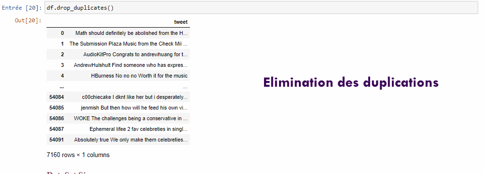

# TweetsProject-SouideneOns-3DNI2

# I-Objectifs:

- Maitriser l’API de twitter pour l’extraction des tweets
- Maitriser la partie NLP (natural language processing) avec NLTK en Python
- Appliquer les principes de nettoyage des données
- Classer les tweets : regrouper ensemble les tweets qui sont similaires. 

# II- Réalisation:

## Partie1: 

On va consacrer cette partie pour rélaiser nos objectifs souhaités 

Commençant tout d'abord parla préparation de l'environement du travail: 
  - Intallation de la bibliothèque twitter .
  - Téléchargement des Tweets à partir de Twitter en utilisant l’API de twitter .
  - Utilisation de la bibliothéque NLTK .
  
 Ensuite on passe à la phase la plus importante qui est la phase du pré-traitement du donnée.
 Dans cette partie on va faire le nettoyage de données telle que:
  - Dropping unnecessary columns 
  - Dropping ponctuations 
  - Dropping emoji 
  - Dropping duplicates 
  - Dropping URL
  
 Puis, on s'intéresse sur le traitement des tweets : NLP (Natural LanguageProcessing)
 Cette partie est divisé en 4 sous-parties, telle qu'on trouve :
  - Tokenization
  - Tweet_nonStop 
  - Stemming and Lemmatization 
  - Vectorization
 
 Finalement, on termine notre projet par la Classification des tweets en utilisant le kmeans 
 
 ## Parttie2: requirements.txt
  - numpy == 1.18.5
  - matplotlib == 3.2.2
  - py == 1.9.0
  - scikit-learn == 0.23.1
  - scipy == 1.5.0
  - seaborn == 0.10.1
  - statsmodels == 0.11.1
  - pandas == 1.0.5
  - ipywidgets == 7.5.1
  - ipython == 7.16.1
  - glob2 == 0.7
  - nltk == 3.5
  - tweepy == 3.9.0
  - wordcloud == 1.8.1

## Partie 3: Réalisation des GIF

  # GIf1: Réalisation du NLTK :
  
  
   # GIf1: Classification Kmeans :
  

# III- Conclusion:

Le traitement du langage naturel est un vaste domaine et il y a tellement plus à faire sur les données pour obtenir des informations plus précises et utiles. Cela vaut la peine d'être exploré!

